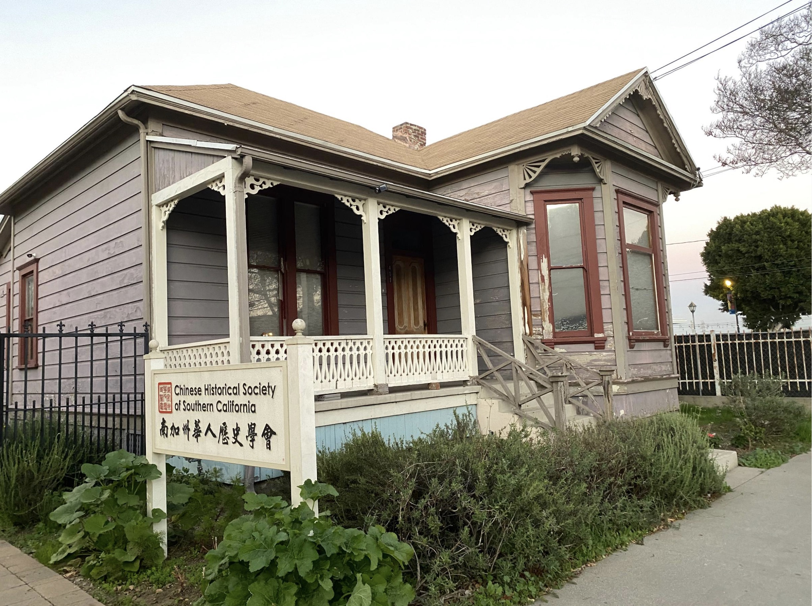
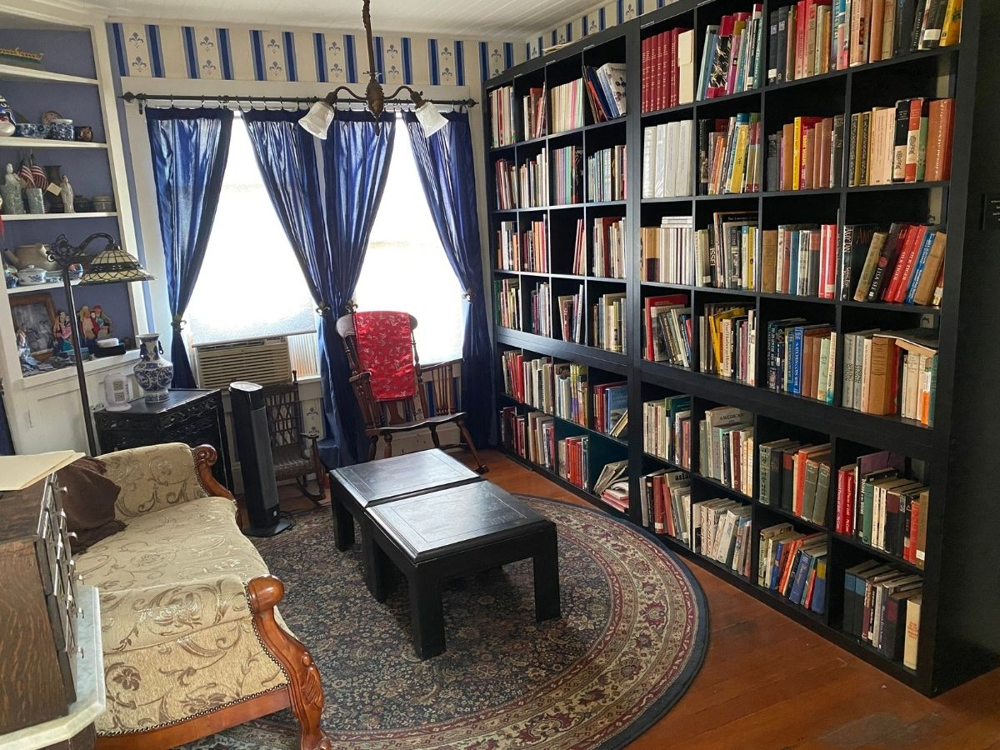

\
_Led by the Yee brothers, CHSSC organizes a flag brigade and marches in the Chinese Chamber of Commerce's Lunar New Year parade in Los Angeles Chinatown for the first time. CHSSC has continued to lead the parade since then. (1976)_

 

# Overview

The two Chinese Historical Society of Southern California (CHSSC) archivists we interviewed provided a comprehensive job overview: their archivist, **Riona Tsai,** a UCLA MLIS graduate, described the day-to-day and early career realities; and board member and chair of the archives committee, **David Castro,** offered a broader institutional perspective. 

The interviews emphasized that archivists **simultaneously fulfill many roles** and Riona noted the job description did not fully capture the scope of work. At CHSSC, priorities include processing a backlog of 200 linear feet of archival material, strengthening disaster preparedness systems, and developing programming. 

They revealed that **relationship-building with community members** is central to their work. David described a community archive as “a center for preservation for community stories and community experiences.” Other ‘soft’ skills include: mutual respect, trust building, and boundaries, at odds with AI development and its potential LIS use. While David reflected a need for AI guidelines; for Riona, AI is a hard-line. As stewards of cultural information, they both expressed concerns around **ethics and accuracy of AI.** 

David advocated for **improved compensation** despite labor trends. Unpaid internships historically persist at CHSSC. However, David’s leadership ensured their labor is fairly compensated, particularly for undergraduate students. Competitive pay is important to recruit caring LIS professionals because of the contextual, interpersonal, and interpretive demands in community archives. AI lacks the understanding of cultural and heritage artifacts, made meaningful by human relationships — something CHSSC has cultivated.

Finally, the interviews revealed the **structural challenges** of the work. Riona notes the rarity of her full-time position. Due to the high turnover of archivists at CHSSC, organizational memory and standardized procedures are lacking. However, both archivists emphasized that the work is meaningful because it is reflective of their community and ensures that their histories are preserved and accessible for future generations. 

 

# Interview Transcripts

✷ _[Riona Tsai, Community Archivist](./pages/riona-transcript.md)_

✷ _[David Castro, Archives Committee Chair](./pages/david-transcript.md)_

 

_The Chinatown Heritage Center at 411 Bernard St, Los Angeles._

 

_CHSSC Research Center and Library. Their physical library features an extensive collection of books pertaining to Chinese American and Asian history._

 

## 50th Anniversary Video by CHSSC



