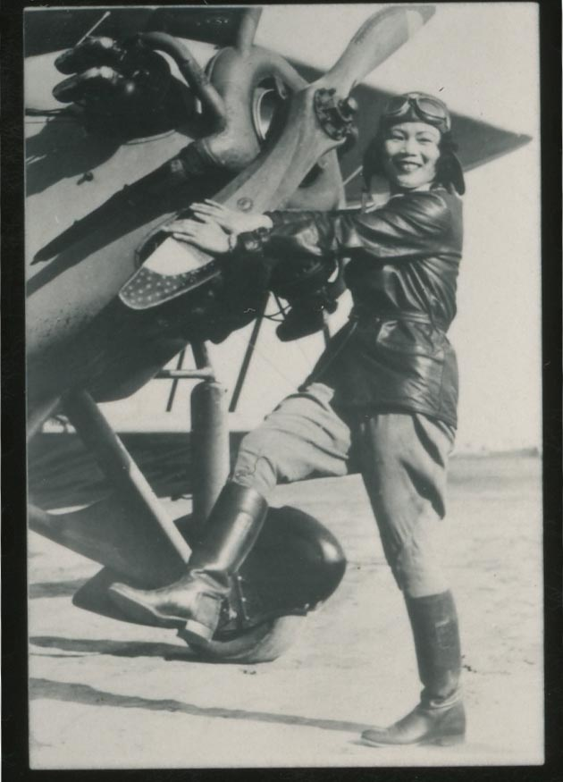

\
_Katherine Cheung, outstanding Chinese American woman pilot with the 99 Club, which was headed by Amelia Earhart (1949)._

# Bibliography

Baik, Crystal Mun-hye. 2022. “From ‘Best’ to Situated and Relational: Notes Toward a Decolonizing Praxis.” The Oral History Review 49 (1): 3–28. doi:10.1080/00940798.2022.2026197.

Castro, David. 2018. "Samahang Pilipino." Los Angeles Archivists Collective. Accessed March 6, 2026. https://www.laacollective.org/work/ucla-samahang-pilipino-david-castro.

Caswell, Michelle. 2021. "Introduction: Community Archives: Assimilation, Integration, or Resistance?" _In Urgent Archives: Enacting Liberatory Memory Work,_ 1–20. New York: Routledge.

Council of Nonprofits. 2026. "Nonprofit Leaders: Federal Funding Cuts Are Driving Service Disruptions and Harming Communities Across the Country." Council of Nonprofits. Feb 23, 2026. Accessed March 9, 2026. https://www.councilofnonprofits.org/pressreleases/nonprofit-leaders-federal-funding-cuts-are-driving-service-disruptions-and-harming.

Flinn, Andrew, Mary Stevens, and Elizabeth Shepherd. 2009. "Whose Memories, Whose Archives? Independent Community Archives, Autonomy and the Mainstream." Archival Science 9: 71–86.

Houston, Alex. 2025. “Bringing Hidden Histories to Light: An Archivist Reflects on AI, Archives, and the Future of Digital Stewardship.” About JSTOR. March 20, 2025. Accessed March 9, 2026. https://about.jstor.org/blog/bringing-hidden-histories-to-light-an-archivist-reflects-on-ai-archives-and-the-future-of-digital-stewardship.

Johnson, Spencer. 2025. “AI’s Role in Preserving Digital Archives.” Historica.org. Historica. May 2, 2025. Accessed March 9, 2026. https://www.historica.org/blog/ais-role-in-preserving-digital-archives.

Lee, Kyootai, and Kailash Joshi. 2020. “Understanding the Role of Cultural Context and User Interaction in Artificial Intelligence Based Systems.” Journal of Global Information Technology Management 23 (3): 171–75. doi:10.1080/1097198X.2020.1794131.

Lo, Leo. 2026. “The University of Virginia AI Protocol: An AI Training and Access Standard for Archival Organizations.” UVA Library. January 27, 2026. Accessed March 9, 2026. https://libraopen.lib.virginia.edu/public_view/2n49t189s.

Potter, Andrew. 2025. “AI and the Future of Archivists and Records Managers: A Global Outlook.” Substack.com. June 11, 2025. Accessed March 9, 2026. https://metaarchivist.substack.com/p/ai-and-the-future-of-archivists-and.

Stanford University Teaching Commons. 2024. "Understanding AI Literacy." Accessed March 9, 2026. https://teachingcommons.stanford.edu/teaching-guides/artificial-intelligence-teaching-guide/understanding-ai-literacy.

 

[⇽ back](../index.md)

