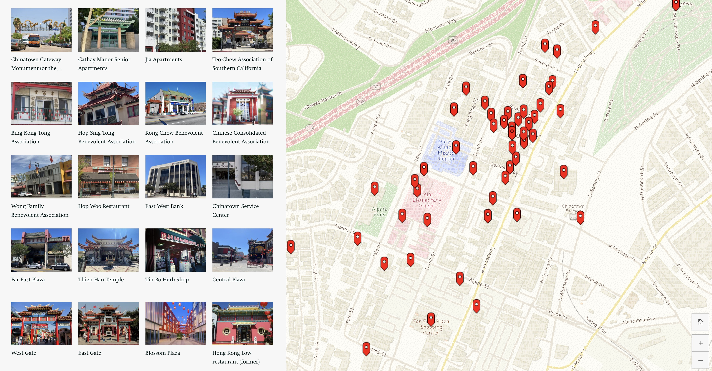
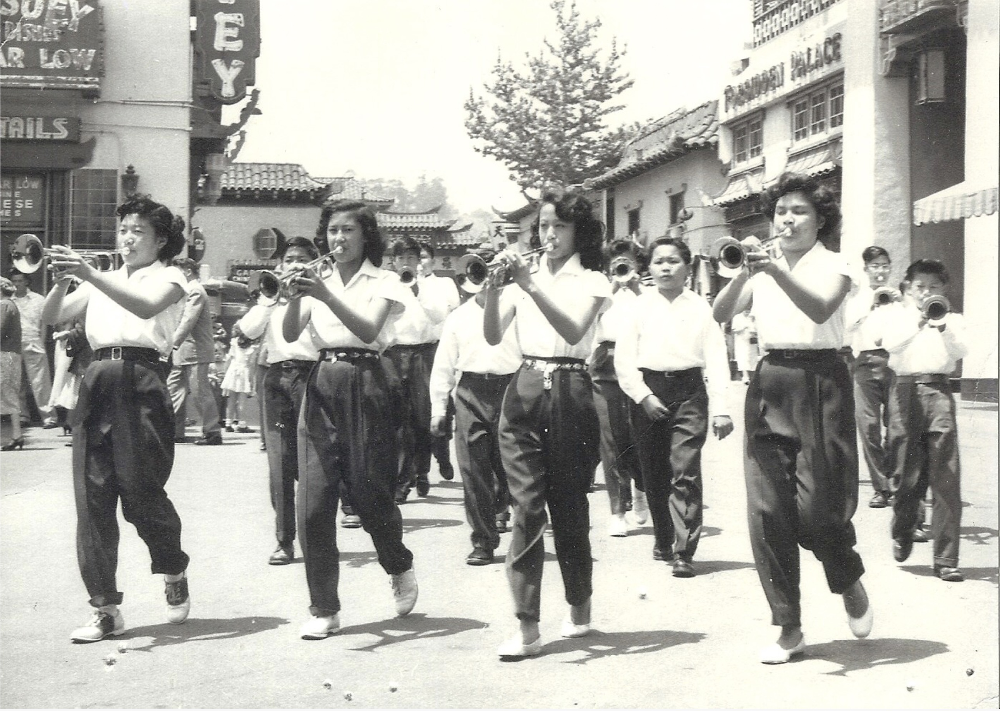

\
_Storymap of historic Chinatown architecture by Riona Tsai (2023)._
_[Link to storymap](https://storymaps.arcgis.com/stories/13abe733662e493dbfde4fa4ca98cf7d)_

 

# Common Responsibilities

Archivists working in community archives perform a combination of traditional archival work, technical digital preservation tasks, and community engagement activities.

- Processing archival collections (arrangement and description)
- Creating metadata and managing digital collections in systems such as digital asset management systems (DAMS)
- Digitizing photographs, audiovisual materials, and documents
- Providing reference services to researchers, students, and community members
- Managing collection backlogs and conducting inventory work
- Developing archival procedures and documentation
- Supervising interns and volunteers
- Conducting outreach, programming, and community events
- Building relationships with donors and guiding them through the donation process
- Supporting emergency preparedness and preservation planning

Because community archives often have very small staff, archivists must also develop creative solutions for preserving unusual materials (e.g., newspapers, clothing, or fragile correspondence) and may need to teach themselves new preservation techniques.

 

### _[🔗 CHSSC Community Archivist Job Description 📄](https://turtledurdle.github.io/IS270-CHSSC/CHSSC_Community_Archivist_Job_Description_v2.pdf)_
_Link opens PDF_

 

\
_First uniforms of the Chung Wah Drum and Bugle and Corps (1954)._
_[Link to storymap](https://storymaps.arcgis.com/stories/445d4315ed564652a1ea599f755f4fa2)_

 

[⇽ back](../index.md)
