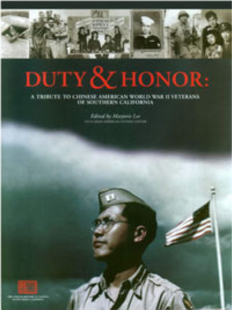

\
_Duty and Honor: A Tribute to Chinese Americans World War II Veterans of Southern California (1994)._

 

**DAVID CASTRO** has worked with CHSSC for over five years, serving as an archival assistant on the Duty and Honor project and as a consultant on digital projects. He recently earned a Master’s in Library and Information Science from San Jose State University, specializing in Archival and Records Management, and an Advanced Certificate in Digital Assets Management. He also holds a Bachelor’s in History from the University of California, Los Angeles. Born and raised in Los Angeles, David developed a deep affinity for understanding the evolution of the city’s cultural landscape and the diverse communities that have called it home. This passion led him to appreciate the vital role of local community archives in preserving and sharing the rich, diverse histories of the city and the rest of the Southland. Currently, David works as a Special Collections and Archive Processing Specialist at California State Polytechnic University, Pomona.

 

_°❀⋆.ೃ࿔*:･ TRANSCRIPT START °❀⋆.ೃ࿔*:･_

 

**Cheeyeon**\
So let’s get into it. I want to ask you about your organizational mission and your current role at the Chinese Historical Society [of Southern California]. Could you begin by sharing your current priorities at the Chinese Historical Society and describing your role there as an archivist? We’d also love to hear about the Duty and Honor project.

**David**\
With regards to our priorities and our mission at the Chinese Historical Society, at least with regards to the archive, our main focus is getting through backlogged archival collections. We have about 200 linear feet of material, about 100 feet is processed, the other 100 feet is not. So we're working towards getting that additional 100 feet processed and made accessible online through OAC (Online Archive of California).

OAC is where we host our finding aids and will be the most direct access an individual would have to view the material in each of our collections. Along with that, we're also currently placing a lot of emphasis on emergency preparedness, developing emergency preparedness policies with regards to how the operations would persist during the event of a fire or the event of a natural disaster that would affect onsite operations. So in this case, it's developing criteria or rather a workflow for completely transforming all onsite work to remote work for archivists and interns. That looks like developing a list of possible digital projects, that the archivists can take on; that looks like also developing a comprehensive guide as to how to approach disasters that also might affect like the stability of the archive itself from collecting material that might be used for, I don't know, let's say mediating a flood that might occur in a repository. Also collecting a variety of different phone numbers that would be useful in the event of a disaster, for example, collecting information on who our insurance provider is for the building itself, collecting information on who to contact in the event of a natural disaster. In this case, we have direct phone numbers to the business improvement district in Chinatown. 

In emphasizing emergency preparedness, we applied for a GroundWorks One grant through the California State Library. That grant went towards purchasing emergency preparedness supplies along with providing us with free courses on what it means to put an emergency preparedness plan together. I think at some point also, we were also introduced to the process of salvaging wet books and wet material and stuff like that through one of these courses. In addition to that, we applied and won the GroundWorks Two grant through the same entity. Money for that grant went directly towards installing our fire suppression system that's still currently underway. To speak a little bit about that, we looked into specifically purchasing a fire suppression system that's, what's the word, it's sort of like powder based, aerosol based, as opposed to a system that is water based, in the sense that an aerosol based system is pretty much just like powder particles that would be sprayed into a repository that would not be so detrimental to the material in our repository as opposed to water that would be coming out of a sprinkler system in the event of a fire. 

Last but not least, I would say a third priority of ours is just getting much more acquainted with the process of producing programming, like external partnerships with organizations and entities in the public history world. For example, we were recently reached out to by the National Park Service because they are requesting materials from our Donner Summit collection that pertains to material that was used by, I believe, Chinese and Chinese American excavators. Donner Summit, Donner Pass in particular has a rail system that at one point or another ran through a tunnel up in that mountainside and it was Chinese Americans who built that tunnel. And they left behind all sorts of everyday material like kitchenware to pots and tools and so on and so forth, which we currently have in our repository. And to make a long story short, the NPS wants to use this material in a new exhibition that they're going to come out with on Ellis Island that goes into the history of Chinese Americans and their experiences and their presence in America starting as far back, I believe, as the early 1800s. So that in itself is just reflective of a partnership that we want to pursue and from a greater sense, gain experience from to guide our practice with forming at least education programming.

Now in terms of my role as an archivist, I'm not necessarily the archivist who does the processing, who does the everyday reference and digital access work there. I'm the chair of the archives and in that sense I provide guidance for our community archivist, who is Riona Tsai. 

So CHSSC operates as a non-profit. There are many arms to CHSSC. We're just one arm of the whole of the whole organization if you will. There's an educational arm. There's also a community outreach arm along with a fundraising arm of sorts and the people in the board space don't necessarily know what we're doing 100% of the time in our archival setting. So it's my job to present updates to the board every month as to the work that's being completed by our community archivist, any sort of new updates concerning partnerships or people reaching out to us in terms of community members looking for material to reference like that type of stuff. So simply put I'm sort of like a director of sorts and I also share this role with two other folks on the archives committee. We try to hold archive committee meetings at least twice a month to just go over the current work that we're doing along with crafting ideas for future endeavors, future projects. So that kind of sums up my role and then to quickly simply give you a little bit more information on Duty and Honor [Collection]. The project itself took place between 1996 and 1997. The part the project had was Marjorie Lee who at some point or another served as the librarian at the I believe it's the Asian American Study Center at UCLA.

**Cheeyeon**\
Yeah.

**David**\
Is she still there?

**Cheeyeon**\
Yeah she's still there.

**David**\
Okay so yeah she's the one who at that time took on this initiative within CHSSC and she's still a part of the organization to this day. She took on the initiative to collect oral histories, World War II memorabilia, infirmary, like separation documents, any sort of documents that track the history of a veteran's experience in World War II. And to narrow it down like she was particularly focused on Chinese American World War II veterans who lived in the Southern California area. So this included folks from Los Angeles as far as San Diego and as far as Ventura as well. And the culmination of her work led to the creation of the Duty and Honor book that in a way synthesizes all of the information that she gathered.

The book itself also lists over like 300 veterans that contributed to this project in some shape or form. Skip to the year 2018 it was under Albert Lowe. Albert Lowe was like the principal archivist for putting together the Duty and Honor Collection. I worked under his supervision as an intern at the time and it was my responsibility to transcribe about 40 to 45 oral history interviews that were given. And I produced full-fledged word for word transcripts for this project along with also digitizing some 35 millimeter slides.

All in all the collection still serves the community well to this day. For example back in 2018 President Donald Trump at the time he signed into law, let me rephrase that… He kind of signed into law in a sense that Chinese Americans who served in World War II were going to be federally recognized through the distribution or like the honor of being given a congressional gold medal for their experience in World War II. And so because of this you know a lot of community members have to come to our archive and consult the military records we have in the Duty and Honor project to then send over to whichever federal agency was taking care of this process, send over this information to them to verify that their loved one was in fact part of the U.S. military at the time… that's a great example of how even to this day the the Duty and Honor Collection is still useful. I know that was a bit of a long-winded sort of answer but does that kind of cover what you were looking for?

**Cheeyeon**\
Yeah that was really useful thank you so much. So my next question is, beyond your work at the Chinese Historical Society, what does an aspiring community archivist need to know about working in this field in general? What kind of boundaries are necessary to do this work in a sustainable way?

**David**\
I would say is that a community archivist needs to know that the field of community archiving is first off financially unstable field to work in, we have one employee for example and in order to hire her as a full-time archivist we had to apply for a Mellon Foundation grant which we received, this was a grant for a total of $100,000 and we were able to split the grant to two years so she was being given a $50,000 salary for two years of her work.

The unfortunate side to that is that this position did not come with benefits or like a retirement plan and that's simply because the Historical Society just could not afford to sustain a package like that so she had to go in with this understanding that she's only going to be paid her salary and nothing more than just that.

For the longest time before Riona we tried to sustain our archival employment if you will with part-time archivist and the funding for that usually came from like generous endowment money that we received from community members and more often than not we were able to support like, 15 to 20 hours per week… so we would only be able to afford to employ an archivist for a year if we're lucky maybe a year and a half at a time and the turnaround for our employees really does affect like the sort of like the continuity or like the common practice of the archive in the sense that if there is no off-boarding, like list of projects for the next community archivist to take on or actions that the current community archivist took place in, it would lead to a hard environment for the next community archivist to take up efforts and continue the work that's done in our repository so that's a big like issue as well. And then I would also say within the environment itself like a community archivist is also expected to play a jack of all trades meaning you may be expected to know or possess knowledge about archival processing but also knowledge about digital infrastructure and metadata schemas and how to manage and supervise interns and whatnot. 

When I think of boundaries I think of personal boundaries and I think the one thing about working in community archive is that you might work with folks again in our space like the board that might not know the type of work that you do and might just throw random duties at you that don't fall under your scope so in the case of our community archivist she's had to develop like setting up personal boundaries in the sense of being confident enough to say no and to address random work in a very professional manner, letting like board members know that she's only here for archiving and she's not here for like crafting membership lists or working on a newsletter and something of that nature. I'd say setting up personal boundaries from the onset of any sort of community archivist role is definitely important in your environment.

**Cheeyeon**\
Thank you so much, I’ll pass it on to our teammate now.

**Jana**\
We're interested in glimpsing a snapshot of technical and soft skills that are required for this role. I'll ask about in terms of working with community members, how do you foster trust and then also how do you balance grant deliverables and general professionalism with community building?

**David**\
In terms of developing trust with community members, it looks like continuously updating our community on what we're doing in the archive whether it's through a newsletter or a personal handwritten letter. For example um I recently received a letter from Paul from the Paul Louie foundation and they're one of our biggest donators and they express really great enthusiasm and support for what we have been able to do in the past year especially with winning the Mellon Foundation grant. There's often the case too that we present during our monthly webinars where we'll update folks on work that's been done on a collection, those webinars usually get a large crowd like anywhere between 50 to 70 people. That's one way we kind of try and reinforce or foster that trust with our community members and then when it comes to reference requests we do our very best to walk them through the process of providing them research help or archival help and in some cases there's the process of collecting a fee for scanning a photograph or providing an audio visual file. We just do our very best try and be professional as much as possible in each moment of connection and interaction that we have with our community members.

**Cheeyeon**\
That was great thank you, I think Sage is next. 

**Sage**\
Yeah thank you for that. We had some questions for you about labor trends and we were curious how reliant your organization is on unpaid interns and volunteers and if that's a typical model for community archives.

**David**\
Yeah so I've done my best to push forward this idea that interns should be paid and this kind of falls in line with a much broader sort of movement and understanding within the field that any sort of labor or work should be paid. Period. Before I got on board as the chair of the archives there were opportunities for interns to get paid. I was an intern so I've been a part of the society for about nine years. For about seven of those years I was interning here and there for them and there were opportunities for me to get paid for each and every one of those roles that I took on and I would say at least within our society it was common practice for interns who were undergraduates not to get paid, graduate students like current MLIS students or even recent graduates it was common practice to pay them. But for the case of undergraduates I've tried my best to change that perspective within the board space and we have now been paying our undergraduates. My role itself is a volunteer role and I chose to take it on because I felt like this position was going to provide me immense skill, leadership, grant writing, organizational, management and so on.

I'm a full-time employee at Cal Poly Pomona special collections and archives. I'm the archives and rare books coordinator here and trying to balance full-time work with supervisional sort of director role in a non-profit is really hard to do, to balance free time at home and then also some free time at work to respond to emails and whatnot. Those instances compound over time so it's a trade-off at least for me with regards to the free work I've provided as a volunteer. Just to wrap this all up the framework has been to not pay undergrads, pay graduate students, we flipped it in the sense that we're paying undergrads now.

**Sage**\
Awesome thank you, we were wondering how you anticipate AI impact in your work and do you have any concerns about AI's impact on the mission of pursuing preserving and communicating the impact and history of Chinese and Chinese Americans in California?

**David**\
Yeah that's a good question. AI is taking over in the sense that companies like Preservica for example, if you're not familiar with Preservica, Preservica is a standard preservation platform, long-term preservation for digital files, there's also a front facing component to it as well. Recently I attended a seminar that was provided by Preservica that detailed all the unique interfaces that are entirely powered by AI, there was a number of different workflows they explained but some of the workflows that come to mind is the ability for AI within the system to immediately deaccession or weed out duplicates from a bulk of digital files that you upload into the system. AI within their interface would also be able to provide descriptive metadata that it extracts from, for lack of a better word, viewing the image or the scan of a document that you upload. There are a number of other AI components or widgets built into that platform but I walked away thinking that they're on to something but it will have drastic effects to the work that we do. Before this web seminar I also attended a seminar that was provided by Jstor, it was an in-person seminar at UCLA, and their own digital asset management system is also building or rather incorporating all of these similar AI components and widgets that Preservica was explaining in their seminar. Within at least the Jstor seminar I was welcomed in a room full of other professionals from different universities like UCLA and CSUN and the one point they brought across is that if AI does all of the metadata for us and quality assurance work for us then in some ways that would reduce the role of a metadata librarian or a metadata specialist to nothing more than a quality control agent, someone who might just need to review the work that AI has done for the repository. If that's how the landscape is going to turn then what would the administrators think, university administrators who don't have any knowledge of what we do on a day-to-day basis, what are they going to think when they see that all we're doing in our respective roles is doing quality checks. Does that then mean they'll lower the compensation for those in this specific niche in the field or would they completely do away with them all together? Like that itself is a worst case scenario way of thinking but in the sense it's very much real because academic universities are always at the risk of budget cuts.

The last point I would make, totally different from like the real world work aspect, it goes into theory with like culturally sensitive material that that can be found within collections that represent Chinese Americans or Chinese experiences is very much a nuanced way of describing material from a culturally knowledgeable, empathetic realm that is required to describe and to provide access to this type of material. AI in a sense may not possess that background knowledge of a culture or that empathy or experience to then guide its description so like that's the one very unsettling nature of that rapid metadata description interface AI would be responsible for. 

**Sage**\
I guess to expand on that then are there ways that the society is thinking about how to safeguard the materials from that kind of exploitation? 

**David**\
I'll be honest, I don't think AI has reached our conversations just yet. There was one instance where a community member had an image that they scanned from us, I think it was 96 dpi resolution that isn't all that great for publishing in a physical book and unfortunately we could not locate the physical representation in our archive so this patron only had the digital file to go off on and they were in a sense pressuring us to use ChatGPT or any sort of different AI photo enhancing software to update the resolution or in some ways have AI recreate the image into an upscaled image and ultimately we told them that's not part of our responsibility, that you can do that within your own time. Although we did dissuade him from doing just that but at the same time we're stewards of history, we're not trying to alter it in any way. I wanted to see what AI would do to an image that was very grainy like the one that he provided so I asked it to enhance the image. So the image was of a young child taken probably some time in the late 1800s, 1890s to be exact, and it was a Chinese American boy, it's a black and white image and the resulting upscaled image that ChatGPT turned out looked nothing like the boy that was pictured in the original scan that was provided. I ran the process maybe two or three more times and each of those times, there was some feature of the boy's face that was different. That in itself was a lesson for me and ultimately a big takeaway was that you really can't trust AI with photographs that might picture a relative or sensitive content because in some shape or fashion it's going to alter the image. 

**Chanel**\
I guess I'm next, that is a really good example thank you. Since this interview is going to be shared with our classmates, can you tell us how your MLIS degree has prepared you or not prepared you for these positions both theoretically and technically?

**David**\
I did get my MLIS degree at SJSU, I did my very best to take classes that would help inform my work in archives and in rare books. There were a lot of classes that delved into the theory of archival arrangement, we learned a lot about archival bonds, original order, respect des fonds, and all that type of stuff. Because it was a remote based curriculum there weren't classes I had to go to and also the internship opportunities, we had to look for them ourselves. I did full-time work at the Getty Research Institute then here at Cal Poly Pomona so I was attending school at the same time that I was doing like full-time work so I was able to use the knowledge I had at work to produce assignments and vice versa.

What I found really useful for me were classes that were based in digital archiving in some shape or form, so I did take a class in digital forensics that taught me how to extract information from legacy formats, for example floppy disk. They taught me which software is to use and which hardware to use to extract information. In a separate class, I was able to learn how to navigate the Preservica environment and for the for the length of 16 weeks all of our assignments related to building digital collections within Preservica and that was important because the job I'm at today, Preservica is used here and more than likely will is also used in a variety of other academic institutions. So having that preliminary knowledge really helped me navigate the Preservica work that I was performing here, which involved ingesting digital files, ingesting metadata, and disseminating material on the front facing platform. I also was able to graduate with a digital asset management certificate from my MLIS program and just having that certificate alone was really helpful when interviewing at different libraries because it was something I was able to always point to and it showed to employers that I at least had some sort of foundation in digital asset management so that was very helpful. I'd say overall SJSU has its pros and cons and I could spend hours talking about the pros and cons going through the program but I feel like overall it was helpful.

**Chanel**\
Glad to hear that. One last question: what is the usual method for hiring at CHSSC and is it mostly internal hires or which avenues do you use for external hires?

**David**\
So CHSSC has a network that's built out. In the past we've worked with various professors on projects, like MLIS professionals as well, so we usually rely on our network to facilitate or to fill in a role. For the most recent [community archivist] role, we circulated that application around to you interns who worked with us through Michelle Caswell's internship program, so Riona was a part of a past cohort of that internship program. Before her we had the opportunity to host three other members from that program. Often is the case too that we will have community members cold call us or cold email us to see if there's any opportunities available and if the time lines up well then we'll have them join us for a small project. If not then we always keep them in a pool of other applicants to reach out to when time comes that we have a new project available.

**Chanel**\
Thank you, I just have a quick question. I’m wondering if you think Riona would be available or interested in an interview like this. Just so that we can get some more on-the-ground experience. How long has she worked there for?

**David**\
So as the full-time community archivist she's been on board since last November. Like I mentioned she was a part of the 2024/2025 cohort of Michelle Caswell's program and then even before that she was hired as an undergrad to perform work on a community project. I believe it was called the Chinatown Remember project that was led by a professor out at Cal State Sacramento so she's been with us for quite a while and she's produced a lot of digital exhibition type of work with us as well as an intern. So yes she I think she would definitely love to talk with you all and would have really great answers to what you've provided.

**Cheeyeon**\
One last question to wrap all of this up is how would you define a community archive? What makes the Chinese Historical Society a community archive and what does it mean to do this work at a community level independent from an institution? How does this institutional kind of dynamic affect Chinese Historical Society's work?

**David**\
So I would define a community archive as a center for preservation of community stories and community experiences, and they're important because at least for the case of Chinese Historical Society, our number one mission or number one goal is to disseminate the experiences of Chinese and Chinese Americans in Southern California. That might not be the priority of an academic institution that might have many different collecting areas that are also butting up against each other for dissemination or programming. Working at Cal Poly for example, we have four collecting areas and they all kind of butt up against each other during specific seasons or specific moments. That's the reality of an academic institution that has many different collections within many different realms of knowledge. A community archive like ourselves, we know what we're specialized in and we do our very best to push forward with this type of content. What makes it a community archive is a sense that we provide a service to our community, local and far. We've had the opportunity to not only provide reference material for local college students, historians, community members, but we've also worked with folks in China for example, we've worked with professionals on the East coast, in the Midwest. Whether they're private historians writing a book or they're library professionals crafting an exhibition, such as the case with the National Park Service. What makes this a community archive again is just being able to serve our community by providing them the resources that they require for their work.

In terms of doing this type of work independent from an institution, there's no strong bureaucracy that's in the way, when it comes to for example, applying for grants, oh no.

**Cheeyeon**\
Oh his battery must have run out of something so funny

**Chanel**\
Yeah we all know that oh no

**Jana**\
He caught it right in time

**David**\
Sorry about that, my laptop died and I wasn't paying attention to that, but do you want me to just catch up where I last left off? Yeah so I was talking about bureaucracy and when it comes to grant writing for example at CHSSC, we just do it. We get together as an archives committee, we write our grant and it's just that. But to give you an example at Cal Poly Pomona, if special collections personnel wanted to write grants, the writing process and applying for it is great but you also have to account time for getting approval from the dean and then getting approval from like the provost of our academic division along with getting a number of sign offs or approvals from like various personnel within the university. Often is the case that you'll get those signatures, you'll get those approvals, but it is kind of a time wasting sort of process and you kind of have to present justification to each and every one of these entities in a college to move forward with this process. 

Simply put we have that focus of collecting what we truly think is beneficial to our repository. We're not ever under the pressure by a dean for example, or any sort of authority figure to collect a particular donation which is often the case within a university archive. We're kind of like free thinkers and free doers within a community archive is the way I would put it.

**Cheeyeon**\
Great, thank you. I think that answers our questions.

**David**\
Is there anything else?

**Cheeyeon**\
What do you guys think? Not on my end.

**Chanel**\
No, I think that's it. I have experience working in Vancouver's Chinatown so this is really interesting to learn about how LA is preserving history and how integrated you are with MLIS professionals. I think that's cool, that you're doing it in a very systematic way using institutional support.

**David**\
Yeah for sure and it's taken close to a decade of just building up the support and figuring out the best practice to sustaining what we do. Like I mentioned before, writing the letters, reaching out to community members through the newsletter, like that sort of work takes time to produce and I think like the end result of it can be easily overlooked or easily gleaned, as opposed to the continuous sort of processing and digital realm sort of work that's done.

**Cheeyeon**\
Yeah thank you. We'll reach out to Riona, I have Riona's contact as well from Zoe, so yeah we'll do that and I think our interview covered a lot of grounds, but if we happen to have additional questions, do you mind if we ask you over email?

**David**\
Yeah I don't mind. If you'd like me to clarify anything or even proofread the transcript before it gets published, I'm more than happy to do that as well. Well thanks again for reaching out, it's really cool in a way, [as] I reflect on my journey of being in the program and what I'm doing today. At some point I was in your shoes, I was reaching out to professionals, I was conducting informational interviews and all the work that you all are doing right now definitely is going to lead up to a lot of good things in the future for sure. The experience you have now is definitely going to compound and will take you far. Are all of you interested in community archives?

**Cheeyeon**\
Yeah I think most of us are.

**David**\
And do you all have experience already within community archives?

**Cheeyeon**\
Oh not yet, I think starting to.

**David**\
Starting to. Are you all first year, second year MLIS students?

**Cheeyeon**\
Yeah we just started.

**David**\
Oh dope, okay. The one thing I will say is that we're always looking for interns for projects, so definitely during the summer time I think we'll have an opening or two, so I can definitely send you guys an email later this year, sometime like maybe May with more info about any opportunities that we might have.

**Chanel**\
Sure thank you.

**David**\
All righty well, all of you have a good rest of your day and we'll keep in touch.

**Cheeyeon**\
Okay thank you so much, bye.

 

_Note: This transcript was edited by Jana and Chanel for accuracy, clarity, and brevity._

 

[⇽ back](../index.md)

