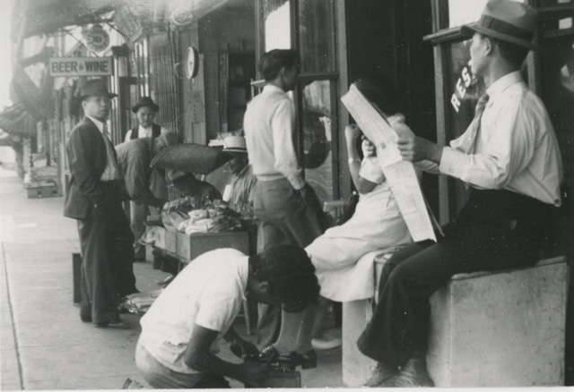

\
_Street scene on North Alameda Street. Part of the L.T. Holman Gotchy Collection (1940)._

 

<h1>Example Job Descriptions</h1>
These postings demonstrate the range of responsibilities across career stages—from processing collections and digitization at the entry level to program management, strategic planning, and supervision in senior roles.

_Each link opens a PDF_

 

<h2>Entry level/early career</h2>

[‣ CHSSC Community Archivist Job Description](https://turtledurdle.github.io/IS270-CHSSC/CHSSC_Community_Archivist_Job_Description_v2.pdf)

[‣ Project Archivist, Dolores Huerta Foundation - UC Santa Cruz](https://turtledurdle.github.io/IS270-CHSSC/Project-Archivist-Dolores-Huerta.pdf)

[‣ Political Collections Archivist - Arizona State University](https://turtledurdle.github.io/IS270-CHSSC/political-collections-asu.pdf)

[‣ Processing Archivist - Rhode Island Black Heritage Society](https://turtledurdle.github.io/IS270-CHSSC/archivist-ribhs.pdf)

[‣ Assistant Archivist - Mike Kelley Foundation for the Arts](https://turtledurdle.github.io/IS270-CHSSC/Asst-Archivist-Mike-Kelley.pdf) 

[‣ Program Manager/Archivist - Black Metropolis Research Consortium](https://turtledurdle.github.io/IS270-CHSSC/archivist-bmrc.pdf)

 

<h2>Mid-career</h2>

[‣ Community Archivist, The Graterford Archive - Haverford College](https://turtledurdle.github.io/IS270-CHSSC/community-archivist-graterford.pdf)

[‣ Archivist for Visual Materials - The Huntington](https://turtledurdle.github.io/IS270-CHSSC/Archivist-for-Visual-Materials-Huntington.pdf)

[‣ Theresa Salazar Curator - The Bancroft Library](https://turtledurdle.github.io/IS270-CHSSC/Theresa-Salazar-Curator-Bancroft.pdf)

[‣ Irma McClaurin Black Feminist Archivist - University of Massachusetts Amherst](https://turtledurdle.github.io/IS270-CHSSC/irma-mcclaurin-black-feminist-archivist.pdf)

[‣ Research Archivist - Friends of the New York Transit Museum](https://turtledurdle.github.io/IS270-CHSSC/archivist-ny-transit-museum.pdf)

[‣ Lead Archivist - Shorefront Legacy Center](https://turtledurdle.github.io/IS270-CHSSC/lead-archivist-shorefront.pdf)

[‣ Archivist - L.A. Louver](https://turtledurdle.github.io/IS270-CHSSC/archivist-la-louver.pdf)

[‣ Digital Archivist - SCULB University Library](https://turtledurdle.github.io/IS270-CHSSC/digital-archivist-csulb.pdf)

[‣ Archivist for Community Collections - University of Michigan](https://turtledurdle.github.io/IS270-CHSSC/archivist-community-collections-michigan.pdf)

[‣ Head of Archives and Special Collections - Center for Craft](https://turtledurdle.github.io/IS270-CHSSC/head-of-archives-sc-centerforcraft.pdf)

 

<h2>Senior level</h2>

[‣ LGBT Director of Archives and Special Collections - GLBT Historical Society](https://turtledurdle.github.io/IS270-CHSSC/lgbt-director-glbths.pdf)

[‣ Executive Director - June L. Mazer Lesbian Archives](https://turtledurdle.github.io/IS270-CHSSC/exec-director-mazer-archives.pdf)

[‣ Supervisor, Archives & Manuscripts Collections - Corning Museum of Glass](https://turtledurdle.github.io/IS270-CHSSC/supervisor-corning-museum-of-glass.pdf)

[‣ Director of Special Collections and University Archives - UC Riverside](https://turtledurdle.github.io/IS270-CHSSC/Director-SC-UCR.pdf)

[‣ Curator of Manuscripts and Archival Collections - New-York Historical Society](https://turtledurdle.github.io/IS270-CHSSC/curator-of-manuscripts-archival-collections-nyhs.pdf)

 
 

[⇽ back](../index.md)

