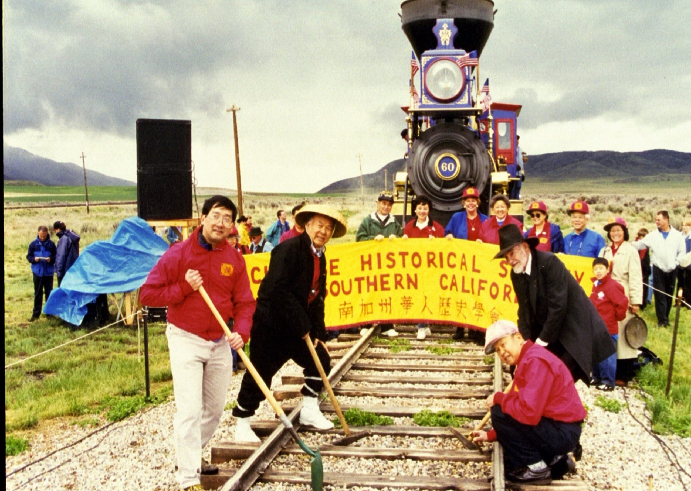

\
_Field trip to Promontory, Utah to participate in the 130th anniversary of the driving of the Golden Spike that completed the Transcontinental Railroad (1998-1999)._

 

# Labor Trends

 

### Constant battle against financial instability
The limited funding of smaller community archives restricts not only the capacity of these organizations, but also their ability to compensate and provide for their workers. These restrictions often burden the staff and place stress on their Board of Directors, as everyone is affected by financial constraints, and few institutions are able to allocate resources to dedicate a singular person to pursue long term financial well being. If the financial state of the organization is not shared explicitly amongst the staff, there is still often an awareness of this financial instability and a work culture informed by the lack of capital. At CHSSC, David shared that he stewards fundraising efforts, including grant writing and donor relations, skills that he is interested in developing further. In his case, he leverages this position to expand his skillset, which demonstrates a potential advantage to gain experiences he may have not been exposed to otherwise. However, he stated that his fundraising priorities occasionally interfere with explicit archival work and it’s a constant balance to manage.

 

### Small steps toward fair compensation
This frequent expectation to be attuned to the organizational foundation can weigh on the workload of board members, especially when they are not assigned a specific or dedicated role of financial oversight like a treasurer. While many smaller community archives rely on staff to fulfill grant writing or fundraising duties outside of their actual scope of work, Riona, as their community archivist, has not experienced any urgent demands to support financial efforts, but has contributed to grant writing. Structurally, the nonprofit model often relies on grants, and this precarity of grants-based funding can impact the work, as was demonstrated by the federal budget cuts which resulted in many abrupt interruptions or even complete ending of programs and services. Further, many contracts require detailed reporting and are time bound, often disbursing payments intermittently and with the expectation that deliverables will be fulfilled in a specific time frame as well. Riona’s employment, for example, was only possible because of a grant, with funding being limited to two years. Her two year employment also, unfortunately, does not cover benefits at this time. Because of the inconsistency in funding, CHSSC regularly relies on volunteers and, at times, unpaid interns. David noted that, historically, CHSSC worked with unpaid undergraduate interns, while graduate interns were paid. He has steered the organization to compensate undergraduate interns and is changing the institutional practice of not paying interns, ensuring they are compensated for their labor. His structural intervention is one example of how leadership can create better practices and standards across labor trends. Continuing to fairly compensate early career professionals is especially important in the LIS field because the work is so contextual, interpersonal, and interpretive while adhering to standards and common practices.

 

### Human relationships over machine learning
AI lacks the understanding of cultural and heritage archival materials that are made meaningful by human relationships, like the ones CHSSC has cultivated for decades within their community. While “mutual learning” between large language models and users seems to preserve a conversational memory or history, there is an emotional depth informed by shared experiences, especially of marginalized communities, that benefit both the archivist and the user. 

 

[⇽ back](../index.md)
