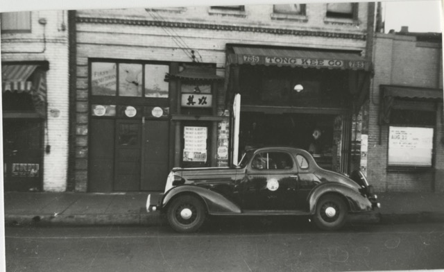

\
_Building at 755 Alameda Street with a car parked in front. On the left side of the building is the First Presbyterian Chinese Mission. On the right side of the building is Tong Kee Co, a grocery store. Part of the L.T. Holman Gotchy Collection (1940)._

 

# Professional Context
Community archivists participate in a broader professional network that includes professional associations, conferences, journals, and online forums. These organizations provide professional guidelines, networking opportunities, and continuing education resources. The journals publish scholarship on archival theory, digital preservation, ethics, and community archiving.

 

## Professional Associations
Society of American Archivists (SAA)\
Association of Moving Image Archivists (AMIA)\
American Library Association (ALA)\
Society of California Archivists (SCA)

 

## Conferences
Society of American Archivists Annual Meeting\
Society of California Archivists Annual General Meeting\
Allied Media Conference (often includes community archiving discussions)\
International Council on Archives (ICA) events

 

## Journals
The American Archivist\
Archivaria\
Archival Science\
Journal of Critical Library and Information Studies

 

## Job Boards and Forums
Many archivists also rely heavily on professional networks, internships, and listservs to learn about job opportunities, particularly in the community archives sector. According to our interview with Riona, archivists frequently use the following sites when searching for jobs:\
[SAA Careers](https://careers.archivists.org/jobs)\
[Archives Gig](https://archivesgig.com)\
[HigherEd Jobs](https://www.higheredjobs.com)\
[Government Jobs](https://www.governmentjobs.com)\
[INALJ](https://inalj.com)\
[ALA JobLIST](https://joblist.ala.org)\
[CLA Career Center](https://cla-net.careerwebsite.com)

 

## Analysis

### Limited but meaningful opportunities
Community archives are still a relatively small sector within the archival profession. Many operate as grassroots organizations or small nonprofits with limited staff and resources (Flinn 2007; Flinn, Stevens, and Shepherd 2009). Because of this structure, full-time positions are less common than in universities, government archives, or large cultural institutions.

### Grant-funded and temporary positions
Scholars have noted that community archives often operate with limited financial stability and rely on temporary funding sources, which can affect staffing structures (Flinn, Stevens, and Shepherd 2009). Many jobs are funded through grants or short-term projects. For example, the CHSSC archivist position described in our interview is a two-year grant-funded role without benefits. This means archivists often move between projects or combine community archive work with other institutional roles.

### Growing interest in community archives
Despite funding challenges, interest in documenting marginalized histories has grown significantly in recent years. Scholars argue that community archives have become an important way for communities to document their own histories and challenge gaps in institutional archives (Caswell, Cifor, and Ramirez 2016). Universities and foundations have increasingly supported this work through collaborative programs and funding initiatives. Programs such as the Mellon-funded Community Archives Internship Program developed by Dr. Michelle Caswell at UCLA, places graduate students in community archives and provides training in community-based archival practice, demonstrates growing institutional support for this type of work.

 

[⇽ back](../index.md)
