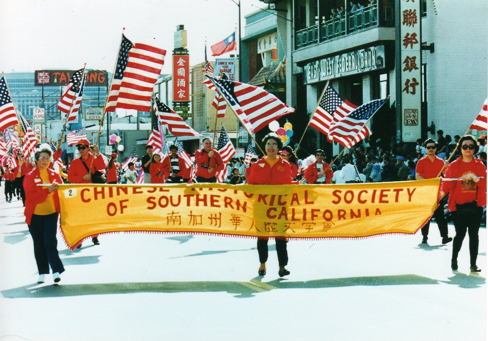

\
_Led by the Yee brothers, CHSSC organizes a flag brigade and marches in the Chinese Chamber of Commerce's Lunar New Year parade in Los Angeles Chinatown for the first time. CHSSC has continued to lead the parade since then. (1976)_

 

# Resources

[Subscribe to the IS network listserv](https://lists.gseis.ucla.edu/sympa/subscribe/is-network)

[Website: Publishing in the Archives Profession](https://archivespublishing.com)\
Huge directory of journals, podcasts, newsletters, bibliographies, and awards.

[Website: Faculty Organizing for Community Archives Support (FOCAS)](https://archivalfocas.org)\
A collaborative of faculty from nine universities in the U.S. and Canada that formed to support paid internships at community archives. Info about past and present interns and lots of resources on the website.

[Book recs: Community Archives, Collective Power](https://americanlibrariesmagazine.org/2025/06/02/community-archives-collective-power)\
Building robust, ethical archival collections

[Blog: Tales of a Community Archivist: Collection Pick-Ups](https://substack.com/home/post/p-157288339)\
Reflections and musings on the wonders of collection pick-ups, Lesbian elders, the power of intergenerational conversation

[Blog: Queer Archivist Code of Ethics](https://substack.com/home/post/p-157909241)\
Principles for ethical, liberatory, and trauma-informed queer archival practice

 

[⇽ back](../index.md)
