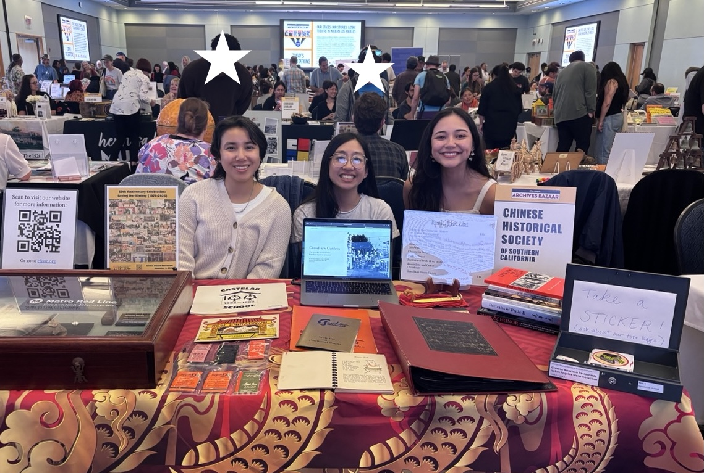

\
_CHSSC staff at Archives Bazaar 2025. Photo courtesy Riona Tsai._

**RIONA TSAI** is CHSSC's new archivist. She received her BA from UC Riverside in both Media & Cultural Studies and History specializing in public history, as well as a Master of Library and Information Science (MLIS) from UCLA. With a passion for community-based history and cultural heritage preservation, she has previously worked on various public history projects, such as A People’s History of the IE, as an undergrad, Cal State LA oral history intern, and as a CHSSC intern. As a CHSSC intern, she worked on the Five Chinatowns Project, created virtual exhibitions, and helped process CHSSC's archival collections. In her spare time, she enjoys going to the movies, collecting physical media, and hanging out with her cats.

 

_°❀⋆.ೃ࿔*:･ TRANSCRIPT START °❀⋆.ೃ࿔*:･_

 

**Cheeyeon**\
Please introduce yourself. 

**Riona**\
Okay, so my name is Riona Tsai, and I graduated from the MLIS program last year, class of 2025. And I'm currently an archivist at the Chinese Historical Society of Southern California. And before that, I went to undergrad at UC Riverside. I majored in media and cultural studies and history and after I graduated, I just went straight into the MLIS program, because archiving was something I was always really interested in. After I graduated, I'm lucky to land this position, since I worked with the Chinese Historical Society for quite a few years, more of an internship capacity. And then eventually, I just started working with them on other types of projects. And then I did the community archives class with Professor Caswell. And through that, I was able to do the Mellon community archives internship last year for a year, which is the position that Zoe is currently in. My main interest has always been in community archives. Even since I was in undergrad, that was kind of my focus, like my focus for history was like public history. So that's kind of something that, no matter if I'm working in community archives or not, that's something I've always wanted to implement, at least the things that I learned within that. But yeah, that's me.

**Cheeyeon**\
Thank you. Super helpful. We read a little bit of your bio on the website, but it's nice to hear it from yourself. As I mentioned, we already interviewed David, so we have an overview of the mission and the inner workings of the historical society. But I think we would like more realistic expectations as a recent grad, as to what your specific roles and at an entry point level, advice for MLIS students who are job hunting and more practical expectations like that. So I will ask you two questions about what would be helpful for our UCLA MLIS program.

So first, can you explain your trajectory leading up to the historical society? You kind of went over it already. But like, how did you get to know the Chinese Historical Society when you're an undergrad, and the influence of Professor Caswell's class? And any other volunteer work or work experiences that you've had before the Mellon internship? So you did just kind of go over it, but maybe you could explain a little bit more in detail.

**Riona**\
Yeah, definitely. Like I said, I started with them in 2020. I think it was 2022. I could be misremembering because it's just been so long. So I had media and cultural studies, because the reason why I got to this field is interestingly enough, it's film. And I'm not a media archives person. I just really like to watch movies. I love film history. So that was my first focus. And then, I really love history and I wanted to add on another major because why not, and so luckily, UCR has a really strong public history program. And I literally just went to the office hours of my public history class. It was Professor Catherine Gudis and she kind of became my mentor. I feel like that's a cliche to be like, go to your office hours and ask the professor and it's like, that actually changed my life. Because then I got this internship with the Chinese Historical Society. She literally was just like, oh, do you want an internship anywhere? And I was like, this sounds cool, because I'm Chinese. I'm from the Bay Area though, so I don't really know as much about the history of Chinese Americans and Los Angeles and Southern California. So I thought it was a really great way for me to learn more about my community, because I do have family that live in Southern California. And [the historical society] kind of just kept asking me back for certain things. So they are currently working on this book, which is about the five Chinatowns of Los Angeles, and they have an internship for that. So they let me join that project. I helped them with other types of digital exhibitions and stuff like that that they wanted to showcase.

## _I feel like that's a cliche to be like, go to your office hours and ask the professor and it's like, that actually changed my life._

And then when I finally did join the MLIS program, I already had that established relationship which is really great. And I knew of Professor Caswell because she's the community archives person. And this is also another case where I literally just went up to her in one of the classes, I forgot which class it was. It was one of the required classes when you're a first year and she was guest speaking. I'm like, hey, I like community archives. I was a little bit more eloquent than that. I was basically trying to pitch myself not for any specific purpose, just so she knows who I am. And then when I finally was able to take the community archives class, I already kind of knew her and she knew that I was really interested in it. And then with that pre-established relationship I had with the Chinese Historical Society, I guess, they're really kind to let me go into a role that I wasn't really in before because I never went into the archives and did like physical processing until I did the Mellon internship. 

When I was out of grad, I did a quick thing, I was helping Cal State LA, doing an oral history project with them. And then, [CHSSC] reached out to me when they got a grant to get a full time archivist like, Hey, do you want to interview for this, but I think they were just kind of reaching out to me specifically, because I already had this relationship with them. And I've worked with them for over a year. So, you know, those types of things are really great to have. And yeah, is there any part of that question I didn't answer? I'm kind of rambling now.

**Cheeyeon**\
No, no, no, you're super clear and great.

**Chanel**\
Was it a coincidence that the Chinese Historical Society already had that Mellon relationship with the community archives lab and that you already had an established relationship?

**Riona**\
Yeah, it was. I think because they were doing an internship kind of thing with Dr. Gudis at UCR. And then they just so happened to have one at UCLA too. And it just kind of worked out. And so that's why I'm saying I think I got lucky, which is not really helpful advice. But like, I'm not saying I didn't work hard, because I feel like I definitely did. But that kind of relationship definitely did. I feel like it did help me get to where I am now. When I started college, it was COVID lockdown. I never really even stepped foot in SoCal before I started doing these internships. And then it was really weird, because I finally moved. And then I'm like, Oh, I'm actually in SoCal now, and in Chinatown, and I've been doing all this work on Chinatown for so long. And so I'm just grateful they're able to give me these opportunities. They have been a huge part of my growth throughout my professional career. So I'm really appreciative that they also gave me this opportunity here, because they've never had a full time archivist. That's a really big thing. And I'm like, Okay, I want to try to do as much as I can here. Because I don't know if they'll ever have another, hopefully they do, after me. But it's pretty cool to be able to have one, even if it's just for a couple years.

**Chanel**\
You mentioned having previous experience in Chinatown. Do you mean in San Francisco or Oakland?

**Riona**\
Oh, no, it's still just LA Chinatown. Yeah, I feel like if I walked through LA Chinatown, I could give random stories, just because I've worked in and about LA Chinatown for so long. But I actually grew up not really around any Chinatown. And I guess being Chinese myself does really lend to the work that I do. 

More about my background is that my dad's Taiwanese. And my mom grew up in Pakistan, but she's ethnically Chinese. So because of this, my mom never really spoke Toisan. So I guess culturally, I feel more Taiwanese. This is relevant. My mom and dad really made me learn Mandarin, that was kind of my first language, even though I was born here. And so I can read and write and speak pretty fluently. And it actually really does help. Like, I don't know if you guys also speak a second language or a third language, like it really does help with in terms of this field, because it's so important. This current collection of processing, most of it is in Mandarin. It's in Chinese, actually, I don't know if it's Mandarin. I think it's in Cantonese technically, but because it's written the same, I've been able to find things that have just been sitting in the archives for so long, because nobody had been able to read it, or decipher anything. I found this new collection of Chinese American newspapers, like Los Angeles based newspapers that have never, to my knowledge, been digitized, or can't find any information about it. So I feel like, it's such a strength to have. And for me, even though I'm not from this community, I'm not from LA I'm not from SoCal, I think [being Chinese] really lends to the work that I do and the passion that I have for it. 

**Cheeyeon**\
Mentioning the language skills is really useful information regarding community archives work. I would like to ask you if there's any other collection of skills that's expected for someone who's hired in this specialization. Or maybe there are particular classes you recommend we take at UCLA. Should we be looking for particular kinds of internships?

**Riona**\
Honestly, the biggest thing you need to learn for community archives is to learn how to learn, if that makes sense, because you're just going to be doing random stuff that you don't necessarily have the training for. So for example, I literally had this book where I'm like, okay, well, now apparently I need to figure out how to do rare books because I have this book and it's just me, and that's a lot of what being in community archives is you're just doing random stuff. One time I found a bunch of clothes and I'm like, okay, I guess I need to learn how to archive clothing now. And I'm just gonna look this up and I'm gonna become an expert right now. 

## _Honestly, the biggest thing you need to learn for community archives is to learn how to learn, if that makes sense, because you're just going to be doing random stuff that you don't necessarily have the training for._

**Cheeyeon**\
Can you give some examples of that?

**Riona**\
Like in terms of?

**Cheeyeon**\
Like, finding unexpected forms of archives, like clothes that you might have to teach yourself, what are some other random things that you've had to learn on the spot?

**Riona**\
Well, I'm trying to learn how to archive newspapers. And that is hard because you look up the standards in the profession, right? You get those giant storage map things that you put with the drawers that you pull up. I don't have the money for that. Are you kidding me? And then they're like, oh, put each issue in a little cardboard, and then a folder, and it has a little mylar thing. I'm like, dude, this is too much work. And it's one person, it's me. I basically bought a mylar roll, which is already expensive. I didn't realize the one we bought was $100 for one roll. I was like, are you kidding me? I went through that really quick. But I was trying to create a clasp for the newspapers. And creating one for each issue isn't going to work because that's too many rolls. And I went through this mylar roll immediately in two days. So I need to figure out based on the budget, what can I do to best protect these newspapers? Obviously, I want to digitize them. I don't know if you guys have experience in scanning stuff. That takes forever. So I'm like, okay, I need to figure out a way to like, I need to digitize these, but also I need to try to figure out a budget friendly way so that they are stored properly.

David is great. But he works a full time job, he's not on site, and he is busy. So a lot of the time, it's just me in the room just like, okay, what can I do? And I'm just searching stuff up and kind of making it up as I go. And I do that with a lot of things or even [with] artifacts, sometimes and especially for non-traditional, non-white communities, [I’m] like, okay, let's see how to preserve this. There's nothing. Okay, well, let's figure that out. And so I kind of have to just figure it out or ask community members, what is this? Like, how do I best preserve this in a way that's culturally sensitive, but also, it will actually be preserved well. 

## _...even [with] artifacts, sometimes and especially for non-traditional, non-white communities, [I’m] like, okay, let's see how to preserve this. There's nothing. Okay, well, let's figure that out._

So I think there's a lot with Chinese archives that you don't learn in traditional schooling. And in terms of classes to take honestly, I'm sure you've heard this before, but this kind of technical stuff is really, really great. For example, I don't know if any of you guys are going to take the metadata class or the DAMS class next quarter, because I think that's usually in the spring. But that was incredibly helpful because I'd done metadata before in undergrad, but getting to really learn more about the behind the scenes of that was really great. And because the general thing about archiving is you're not going to learn everything in the program. There's a lot, you're not going to learn a lot actually, in terms of technical skills, which is kind of unfortunate.

I'm not saying anything about the program, it's literally just because there's so many new technologies coming. And there's so many different types of softwares and so many different types of materials that you have to learn. And so with this field, generally, not in just archiving, but like, you're just always learning new things, but especially community archiving, you kind of have to get creative. And that's a skill that you have to refine.

**Cheeyeon**\ 
Yeah, that's super helpful. Can you recommend maybe one or two more classes other than metadata?

**Riona**\
I really liked the oral history class with Vo-Dang. I don't know if she's doing it. I really, really liked that class. Also, she was my faculty advisor, so I'm kind of biased. And I also took a class, I don't know if Professor Villa is teaching this class. But my second year, she was teaching a disabilities class, like disabilities in libraries and stuff. And then I also took a class on surveillance with her. And both of those classes were incredibly helpful. And they might not be in the traditional sense of like, oh, this is library and archival theory. But I feel like I learned so much about implementing stuff like accessibility, and considering things about privacy, and just a lot more like cultural awareness for things. And I don't think people realize how much of that kind of training that we need, especially if you're working in more public facing, like in public libraries, right, when you're in a public space. And so, again, because those were the 289 classes. So those are the ones that are not set. But she's a great professor, but it was only her first year, I only had her when she was in her first year. So I don't know if she's teaching other classes, but she's great because I think she's in informatics, which is like not really the field I'm in, but the classes that she teaches are really, really great.

Yeah, those are my favorite classes because I feel like in those ones, I was able to utilize a lot more, obviously learn technical things, but also learning about more having cultural awareness of things, because especially as being the person you're seen as a professional, I think that's a really important thing to have no matter what type of job you have, like if it's in libraries, if it's in archives, special collections, that's so important.

**Cheeyeon**\
I had one more question, returning to your day to day, learning and work at the historical society. You mentioned that sometimes you encounter archives that are sort of specific to the ethnic background of the Chinese communities that you might not have training at UCLA, what are examples of those kinds of documents or that you've encountered?

**Riona**\
For example, the current collection I am working on is from this woman called Lily Lum Chan, and she was a really big community leader in the later 20th century and in LA Chinatown. And so she has a lot of stuff about her correspondence or you're reading stuff, especially in Mandarin. People who if they just Google Translate it, they might not know the cultural significance of certain things. And there's only things that I know because of the fact that I'm Chinese. And well, even so, there's sometimes things that I don't know too, because I grew up in the US and these papers were from not that long ago, but still a long time ago. So there are colloquial things, even types of wordings that she uses, types of materials that are used as well that were very common in Hong Kong or China. But now it's not really that common. And so, I don't know what the paper is, but they used to use this type of really thin paper to do correspondence on. And I remember trying to be like, okay, what's the best way to archive it? Do I just put it in a sleeve and we call it a day? And I was looking it up and I couldn't really find much about that. When you write Mandarin, it's like there are lines of paper, because you're writing from right to left, and you're going down like that. And it's just a type of messaging paper that you see us and I couldn't find because, does this disintegrate? 

**Cheeyeon**\
Did you ever take a preservation class for these types of questions?

**Riona**\
Even in preservation, I actually don't know this, I didn't take any, I don't know if you guys have taken a preservation class yet.

**Cheeyeon**\
Chanel and I are taking an intro class. Yeah. Oh, actually, Jana too. Yeah, all three of us. Yeah.

**Riona**\
Well, you guys probably know more than me, I don't even know because I never took that class. But even stuff like, where Mandarin is right to left. They read things right to left. Only I can know when they're reading things right to left. Because I think a lot of the times when you put things out, Google Translate won't register that. And so there's only things that when you know the culture more, and I'm sure this is more than just Chinese cultures, other cultures too. And when you're looking at it, there's things you need to know. And it's not really something you could learn at UCLA. But it's just one of those things that in community archives that, and especially if you're more of an outsider in the community, like I'm an outsider [in the] community, but I'm still ethnically Chinese. So I'm able to understand certain things. 

But if you're an outsider, you're not as familiar with it, it can be quite difficult, and especially when you're looking at personal papers or correspondence, even yeah, just things you're not really familiar with. And so that's one of those things that, why those classes that I mentioned about more cultural awareness and learning about things like accessibility. And those are so important because you never know, and especially if you work in LA, LA is so incredibly diverse, there's so many different types of people, and you never really know, there's not one way to do things. And I think that's the most important thing. I learned so much through the internships and the jobs that I had because I worked at the UCLA library at the Arts Library. And through those jobs, I honestly learned it was really great to have, because I don't know if you guys also experienced this, getting to work at an internship or a job is almost an education, in tangent with the classes that you take the classes are very theory heavy. So sometimes it's just like in my head, but getting to apply those things is really, really helpful. 

**Cheeyeon**\
Thanks, that's really helpful for us to know in what ways everything pieces together from your perspective, having just graduated. Does anybody else have any questions about classes? Because otherwise, I can pass it on to Chanel.

**Chanel**\
I wanted to follow up and ask you, you said that you are an outsider, but you're ethnically Chinese, so you can read the letters and understand the cultural context. By outsider, do you mean that you're not born here? 

**Riona**\
Yeah, I wasn't born in LA and Chinatown. And I wasn't born in SoCal generally. So I'm kind of this person coming in rummaging through their things and dictating what should be saved or what shouldn't be. And so especially when you're working in a community organization, it's like community members have their own opinions and their own mindset of how things should be and what things should be saved. And obviously, it's so important to incorporate that. But especially because I didn't grow up here. I think that's something that I'm really mindful of, because I don't want to seem like I'm just that person going in and taking things and leaving, which is a huge problem. Especially with information professionals, I think that there has been a thing in the past where people will just go in and not really care about, they'll just go in and leave and not really cultivate a relationship which is so important.

I think being ethnically Chinese does help in a way, it's like a sense of trust. Because it's like, okay, you look like me. So I guess that's good. I think it's different though with different people. Because if I went to a different type of community that was elsewhere, that would be completely different than what I'm experiencing.

**Cheeyeon**\
So you've already mentioned the specific tasks involved in the Society. How similar or different is it from the job description that you applied for? I know that the job was kind of made for you, but it was really different, actually. 

**Riona**\
It was, because for the job for the grant, they had to write down what they wanted the archivist to do. And the description of it is literally completely different than what I'm doing now. And the reason why is because I don't think they realize the amount of work that needed to be done on a foundational level, because when you have a community archive, oftentimes it's a part time archivist or a short term archivist, right? [They] kind of just goes in and leaves, goes and then leaves and because of that, a lot of institutional knowledge is lost. And because of that, unfortunately it's a little bit messy. You guys know about most archives, they can be quite messy. But especially at CHSSC, there wasn't really consistent through line in terms of procedures and guidelines. So by the time I came in, or even David or even the person before me, we're all like, what's going on? Where is this? We don't know where anything is.

And I'm still finding things. They created an audio visual spread, they already did this. And we didn't know it because there was really no established foundational, procedures thing. I think a lot of those faults showed up more. And so, I pivoted to start focusing on more creating procedures and guidelines and trying to create a foundation for that so that in the future when there's other archivists coming in and out, it won't be as weird as it was before where no one knew or anything was. And that wastes time because then we're still just trying to figure out what to do. And by the time we figure that out, they're leaving. So that's a huge thing that I'm focusing on now that wasn't even in the job description. And they kind of just let me do that. I just asked David and the rest of the archives and I'm like, can I do this? And they're like, okay, because again, they kind of leave me to do. I'm lucky that they trust me and leave me to do what I feel like is right and what we need. So yeah, it's actually very different.

**Cheeyeon**\
If you have it, would you be able to share the job description that you applied for? I think that'd be really helpful for us to compare your actual experience with like the actual job description.

**Riona**\
There was a lot more processing work. So it was like, Oh, do this Lily Lum Chan collection, do this oral history thing. I'm mostly not doing a lot of books. They're kind of okay with that. They didn't realize how much more of the boring work needed to be done.

And literally just like, I need to clean out the parlor we have, because [it’s] just boxes of random shit in there. I need to clean that, I need to do a whole inventory of the archive because I don't know where anything is. What is this random box in here? Why is there this? What is it? I do a whole inventory of the entire archive. Because I don't know where anything is. Let me just figure this out. You know, so that takes a lot of time. 

**Chanel**\
So this position of yours, it has a two year timeline, right? How do you feel about that? Like, is there opportunity to renew after or are you kind of like, trying to get certain things done within this two year position?

**Riona**\
I went into this knowing it was a short term thing, and they were telling me this job doesn't have benefits. And the reason why I took it is because I'm not 26 yet. For the two years that I have this job, I still have health insurance from my parents. So I'm like, okay, that's fine. Especially right now, a job's a job, and I get more experience. Honestly, the biggest thing is benefits. Unfortunately, that's kind of one of the biggest factors. And thinking about that, if I did renew, I would love to, right? But I need health insurance, so that's low key, my biggest factor. So I guess it depends where I am in two years, because I just started a few months ago. But I would love to keep working at the agency in any capacity to not even just as an archivist, as a volunteer, but I would love to continue. But I do need to think about job benefits, I need health insurance, guys.

**Chanel**\
Yeah, totally. Yeah, you take care of you.

**Riona**\
Yeah, like the pay is not like, well, okay, the pay in this field is never great.

**Cheeyeon**\
Do you mind if we ask you what your pay is?

**Riona**\
It's 50,000.

**Cheeyeon**\
50k. Okay. Solid.

**Riona**\
Yeah, I've never been on salary. That's pretty cool. And honestly, I was expecting lower given how sometimes the pay in this field is. Also another factor is your background and for some people, you need to pay rent too. It's really expensive in SoCal, I don't pay rent. Because I live with my family. So most of my salary is not going to rent, it's going to stuff like taking care of myself, like groceries. So I'm really lucky in that aspect, right. And I'm just really fortunate that I'm able to live in a place where I don't have to pay rent right now, at least we'll see in two years.

**Chanel**\
You mentioned community members and how they have different thoughts on preservation. How do you foster trust with community members? And how do you balance the grant deliverables slash professionalism with community building?

**Riona**\
Well, I think for me, definitely creating an actual relationship based on listening and showing up and that seems so basic. But attending community events and incorporating suggestions and working with the community, like they're part of the project because I think a lot of the time before why there's often distrust of academics, right, is because they don't listen. And there's like, oh, we know better because we have the degree, when that's not necessarily true, that we know more. This is their home. This is their community. And so a huge part of it is to cultivate that relationship with them, and to really, really just listen. And that sounds basic. But I think sometimes, based on how traditional archivists would sometimes be… it's harder than it seems, because it's easy to be like, Oh, it's supposed to be like this, this is a standard. And so it's definitely trying to find that balance of trying to incorporate the skills that you learn and best practices of trying to preserve things, but also trying to listen to the needs of the community. And also this idea of a right to privacy. That respect of if somebody doesn't want it, listen to them. And even if before they're like, yeah, sure. But then later on, they're like, actually now I don't want that. I want this part of this oral history or, I don't want it to be on record, right? It's really listening to that. And I'm not saying just let them do whatever. But definitely finding that balance. 

We were having some trouble at CHSSC because sometimes people just drop stuff off. Donations are just like, here's this random document that I have from 1977. And I'm like, okay, what do I do with this? So we had to really try to figure out, like me and David are trying to establish some more of a donation policy. It's important that we know who's donating what because of provenance, seeing if we have enough space, all of those types of considerations. But for them, it's like, we can just drop off whatever it's like a dumping ground, I guess, some for some people. But so yeah, really finding that balance and listening to the community. That's a way that you can get respect, right? Because then they know you're not just trying to take all their stuff and put it in boxes so they can't take it. And I think this is something you learn, that Caswell really emphasizes very well is this idea in her Community Archives class. I think she talks about SAADA, which is like the post custodial digital archive and specifically, they don't own any of the materials so the materials that they have in the archives is still owned by people after they scan it or whatever, they give it back. And so that's, you know, this idea of mutual respect and mutual trust.

**Jana**\
Thank you. I want to touch on the topic of AI. That's been a significant focus in our class, learning how to navigate that in information institutions. So have AI or conversations about it surfaced yet in your work? Or are you thinking about it or trying to maybe avoid it? I'm pretty curious what your thoughts are on it.

**Riona**\
Yeah, I'm not the biggest fan of AI, or generative AI. The types of AI that I think are pretty useful are for transcription work, that initial putting it through transcription sites, it's actually incredibly helpful as a beginner level of like, okay, here, put this through first, but you still need a person to go through it because it's not accurate. But I know people have a lot of opinions on AI and how it's being utilized especially in this field. Personally, I don't want to use it ever. There's a couple times David brought up ChatGPT, but I'm like, no. Like I straight up was like, no, I'm not gonna do that. Like I think one time we were trying to identify like, I forgot what it was, some kind of AV material. And we're trying to figure out the duration of it, because I couldn't play it. And then we were trying to figure out what type of tape it was. And then he's like, Oh, you could send me a picture and I'll put it through ChatGPT. I'm like, no, I'm not going to do that. Also, can you reverse image search it? I don't know. So I don't want to and this also happened when I was helping out with another historical society and he was talking about utilizing ChatGPT to try to create a story map, which is like, I don't know if you guys are familiar with this. It's an ArcGIS story map. There's a way to present information and tell a story on a really fancy presentation, essentially. And he was talking about using ChatGPT to try to create maps. And I'm like, No, you can't. I was trying to be nice about it. I'm like, you can't do that. Because you're just gonna get lost and that's not going to help you. And this is also factoring the environmental aspects of it, right? So I'm very much like, I don't want to incorporate it. Because I don't think it's ethical. Even since I graduated, there's probably more AI stuff that I don't even know about, and especially for this field. But yeah, I'm a firm no on it. Even with creating a resume, I think I'd rather just make it.

**Cheeyeon**\
Has there ever been a conversation between David and yourself or other archivists in the organization about the use of AI or the possibility of creating a guideline for your organization?

**Riona**\
We probably should. You know, that's a good idea. Because I think for now, it's just kind of been that sometimes someone will bring up AI and I'm like, no, I could just do it. Or we don't need to do that. But that's definitely something we should probably incorporate.

**Cheeyeon**\
We're interested in what kind of conversations are happening between professional organizations or within the professional community.

**Riona**\
Yeah, it hasn't. There is no conversation, which is probably interesting. Yeah, we're not, at least at CHSSC. That's not really a thing. The thing about AI that is concerning is putting things online, like digital archives and making things accessible, which is like part of what we want to try to do. But then you run the risk of people putting it through AI. And it's like, okay, that's not great. And so that's been a conversation. But we haven't really talked that much about it. Now that you bring it up, I'm like, we probably should talk about it. Because even though I don't like to implement it, that doesn't mean it's not there. And it's something that people are using unfortunately. Especially when you're no longer in this position, and they're going to pass it through themselves. I think my biggest thing is like, when I helped another historical society create a story map, I'm like, what if they put my story map through ChatGPT? And I was like, oh my god, well, I can't really do anything about that. So yeah, that's definitely something that we should talk about. We just haven't yet.

**Chanel**\
Our other assignment for this class is to write AI guidelines for an example organization, but we can send ours just as an example, or if other groups share them, we can share it with you.

**Riona**\
That would be great. Yeah, we didn't do that. I guess that just shows how much AI is more of a factor. Now that people are considering it. So yeah, that'd be great.

**Chanel**\
So since CHSSC is a nonprofit, your job is existing for the first time. I'm curious to what extent you or even like, your knowledge of archivists at other community archives, how much do you have to support nonprofit operations or fundraising?

**Riona**\
Like in terms of the organization itself?

**Chanel**\
Yeah, like we were talking to someone at VC Archives. The archivist there unfortunately has to spend over half their time fundraising, like writing grants and stuff. And it just sounds sad, but not a surprising reality for certain groups. So yeah, how much do you have to pay attention to the nonprofit operations? 

**Riona**\
You know what, less than you would think. I think in terms of this role, and even like the archivists before me when I was an intern, the most that we do is some grant writing for a specific thing. A lot of the grants that CHSSC gets are private from donors. CHSSC is a historical society. So there's board members, other volunteers, like David, who have written grants. And so I've never had to do it yet. If there's like an archives specific grant, that's when I usually see the archivists write it or David will be like, Oh, hey, you want to help me? And again, because like a lot of the money comes from the fact that it's a historical society, you know, they've been around for 50 years. And it's a lot of community members donating or they get stuff from other people, other companies, members who just want to donate money. Like one time I went into work and someone walked in was like, here's a couple thousand dollars. I'm like, okay, I don't know what to do with this. I give it to one of the members because I'm not in charge of that. So I guess I'm a little bit more separate from the nonprofit part of it. Okay, so I guess that means I get to really focus more on doing the processing side of things, which is pretty cool. 

**Chanel**\
Yeah, I'm glad to hear that. It sounds like the board has their donor relations and fundraising operations in order. 

**Riona**\
If they asked me to do that, I'd be like, oh my god, I don't know. Yeah, but I guess it is a skill because that's also a really important thing in this field, like donor relationships and all of that. 

**Cheeyeon**\
I think Jana has to hop off right now. But I would like to ask you one more quick question. But yeah, I think Jenna, you can feel free to go.

**Riona**\
Well, it's great to meet you, Jana.

**Jana**\
Thank you so much for your time. 

**Riona**\
Of course.

**Cheeyeon and Chanel**\
Bye, Jana.

**Cheeyeon**\
So what's your advice for job hunting for us MLIS students? Like where are jobs posted? Are there other forums such as blogs, lists, or discord sites that our classmates should be aware of?

**Riona**\
I mean, there's like the classics, like Archives Gig in terms of archives. I mean, there's a bunch of like, what are the library ones called? For academic stuff, there's HigherEd Jobs. I think that's what it's called. I don't know if you guys are familiar with that.

**Cheeyeon**\
I don't know anything.

**Riona**\
Yeah, yeah. There's like stuff like, oh my god, I do not remember. There's a lot of library, academic library specific job sites. I guess if you have a LinkedIn, jobs are posted on there. I don't have a LinkedIn because I'm scared of LinkedIn. I'm so serious. Yeah, but there are jobs that get posted on LinkedIn. 

**Chanel**\
Is Government Jobs one?

**Riona**\
That is one. Yeah, I've definitely applied to jobs on there. Government Jobs, especially for public library jobs, that's one where you can find them. Like, I'm pretty sure I'm part of more lists, listservs. Let me see.

**Cheeyeon**\
Do you mind if you send us a list?

**Riona**\
Yeah, I think that'll be better. 

**Chanel**\
How are your colleagues doing? Like, are they working? Your fellow MLIS graduates.

**Riona**\
A lot of us are doing temp jobs. Or part time. That's what I know of, or still searching because it's really tough right now, especially right now. Most of my friends who do have jobs, they are like, only for a short term time or they’re part time. I don't want to make you all feel sad about it. But that is an unfortunate reality. Not just this field, but it's really hard out here.

**Cheeyeon**\
Are you the only one with the full time job?

**Riona**\
I don't think so. I mean, one of my friends has a full time job. But again, it's temporary. So it's like, it's only still a certain amount of time. One of my friends just got a three year contract full time job. Because they worked at Universal and then they got a three year position there at Universal. And then I had a friend that worked at Warner Bros for a bit. And then she currently works at LA Phil for a part time job, doing digital asset stuff. So yeah, I feel very fortunate, you know, that I'm able to do something I really, really love and passionate about and also have this full time job here at a place that I really care about.

**Cheeyeon**\
What percentage of people who are interested in community archives, would you say is actually working at community archives?

**Riona**\
That’s a good question. For example, because there's five interns for the Mellon grant, right, and I know one of them is working at a community archive, or two of them were, but I don't know how long they were working there. And it's very much like, we can have you on for a couple months. I think one of them is working at an academic archive right now. So a good amount of people, I feel like that's a really small pool. But a lot of the times community archives just don't have a full time thing. And that's kind of the problem. There's a lot of people who aren't just in community archives, but because it's a field [where] it's hard to get a job, they will pivot to other things. And which is why, even when I was in the program, I wanted to learn more than just archiving stuff. I wanted to take the media archiving class to library classes as well. Because I think all of these skills are really important. And they can help with whatever type of job you have in the future.

**Cheeyeon**\
Yeah, I think that's realistic advice. Because Professor Gilliland also says everybody wants to be in community archives. But in reality, those people end up in corporate or academic libraries. 

**Riona**\
So it's really just incorporating what you know. Like I said in the beginning, even if I'm not in a community archives position anymore, I want to continue doing that type of work, like helping or facilitating it. Trying to balance that. And I think community archives, if you guys are able to do the internship, that's a really great opportunity, and you get to learn a lot. One thing about the UCLA program that's really great is getting opportunities for internships and jobs and the people that you get to meet, and the connections you get to make is really great. So take advantage of that. Because I feel like there's so many great people that you can talk to in terms of getting jobs and internships. I wouldn't have been able to get [these opportunities] if I wasn't at UCLA. There's definitely a lot else I could say, but that's a little bit of that for now.

**Chanel**\
Okay, I have one more question. Do you have time?

**Riona**\
Yeah, I'm working at home. I don't know if you can tell. I'm chilling.

**Chanel**\
Okay, okay. This came up as I was browsing through the website. And also from my own experience. So I'm Chinese Canadian. I grew up in Vancouver Chinatown, and ended up working in the community in my 20s. And so my experience with people who are interested in Chinatown history, and people who steward that history are often older Chinese men. Have you had like, are there generational differences that you have to balance or advocate for sometimes? And is it ever challenging in terms of, advocating for certain types of histories that you want to preserve that you think is important?

**Riona**\
Okay, I actually wrote my portfolio issue paper about this. A couple years ago, I wanted to start a queer Chinese American archive at CHSSC just to see, and got a lot of people on board, like Will Gow, he's a professor at Sacramento State who does a lot of work at CHSSC and one professor at UCLA as well. It was like this whole thing. I literally wrote a grant for it. And it just fell through because no one really supported it like that. Like they said they supported it. But then they were like, meh. And so I wrote about it for my issue paper. So when you mentioned, I was like, yes. Because there's no queer histories, when you look at the stuff that we have, it's not that queer people don’t exist. You said it's all a lot of times older men that are continuing to steward these histories. And so I think, definitely. But it's also difficult because when you're in community archives trying to figure out what are you able to preserve. So it's like, obviously, I would love to do more queer histories. And now that I'm in this position, I'm like, let's do it. But there's so much else I have to do right now. I have to try to create these foundational guidelines. We have all this backlog and all of that. And so I think that's not a question that I have answered at all. I'm even just happy that they try to spotlight Chinese American women. I mean, that's kind of nice, at least, that's something. And lowkey is the bare minimum. Again, it's the reality of trying to figure out what's the capacity of what I'm able to change here currently. And so really trying to figure out the balance of what community members want, what I want to try to push. That's not really an answer. But it's definitely something to consider. And it's definitely something I'm always wondering and trying to answer, but I don't think I really can, because it's a difficult one. Especially if I'm this outsider coming in, I didn’t grow up here. And now I'm saying, you shouldn't do things like this, you should do this. I think they're like, who are you? Like, why are you telling me to do that? Right. So there's so many different factors for it.

**Chanel**\
And especially in your first few months, you have to gain the trust of people first.

**Riona**\
Yeah, also, because I'm younger, I think there's this perception of, oh, you're this little guy. Okay, no, I'm trying to be serious here. But you know, there's this thing of like, older Asian people, just in general, I think they see younger people, sometimes it's like, oh, you have to respect me. And you don't know what you're doing. I know more because I'm older. And so I've definitely dealt with that. So it's not great. But that's part of it, you know.

**Cheeyeon**\
I think just going along this trajectory, what kind of boundaries are necessary to do this like community archives work in a sustained way?

**Riona**\
Honestly, I know there's that element of like, trusting, listening to community members, but also stand up for like, hey, okay, we can't do this. You really need to stop bringing drinks into the archive. This is a very specific thing. But that keeps happening. And they keep bringing drinks into the archive. And I'm kind of annoyed. There are certain standards that they don't really know, right. And so, again, trying to balance that and be like, there are actually some things that we have to change and try to really push that.

Even the donations thing I was talking about, I think they're only started really coming around to it now. Because I think before, they would still just keep dumping things and expecting us to do things. I'm like, okay, what am I supposed to do with this? And I think there's also this misconception of archiving because archiving is a very laborious process, it takes a long time. And so things aren't just going to happen overnight. Sometimes there's that expectation. And really pushing back and be like, this is going to take a while. You can be transparent about like, okay, I need to do this and this, but you can't just expect me to do everything for you right now.

I think this is good advice for anywhere, standing up for yourself. Especially in a workplace, right? Just being like, alright, this is a lot more than what I signed up for, or more than what I can do right now. And establishing things like that. So really just asserting yourself.

**Cheeyeon**\
Got it. Will do.

**Chanel**\
I mean, it's kind of like, how my parents or my aunties and uncles would be like, hey, I need something right now. And they expect immediate results. It's a cultural thing too, that you have to communicate.

**Riona**\ 
If you talk to somebody else, this is probably not something [they] have to deal with as much. But I feel like in community archives, I think that's what [we] have to deal with. Because it's like, I think some members just see you as a machine that can do things. I'm like, okay, that takes time though. I'm glad to do things for you. But give me two to three business days.

**Chanel**\
But you're right here. And the scanner’s right there. You're just sitting on the computer.

**Riona**\
Oh, my gosh, trauma.

**Cheeyeon**\
I think we covered good ground.

**Riona**\
Yeah, thank you so much. I'm glad to talk with you guys. And feel free to reach out. I will send you the job description and also a list of the job hunting. So I'll send that to you guys tonight, at least. Well, probably earlier. But today I will send it to you. 

**Cheeyeon**\ 
Thank you. We really appreciate it.

**Riona**\
You could also reach out if you ever need any other random advice stuff too. And for anything, honestly. So thank you.

**Chanel**\
When are you there at the heritage building?

**Riona**\
Ah, most days. Wednesdays, sometimes I take remote because I commute quite far. But I guess like Monday, Tuesday, Thursdays, Fridays, mostly.

**Chanel**\
And when do you open, when do you welcome visitors?

**Riona**\
Well, we open for visitors only one day of the week. Eugene’s the president, he opens it on Sundays. It used to be more before COVID. But people can make an appointment with me anytime to stop by. We have Monday through Friday, honestly, for either visiting or research appointments. If you ever want, if you guys are interested in more of the Chinese Historical Society, I could always put you guys in touch with people like the President, Eugene. He's pretty chill, you know. So feel free to message me, okay, I want to be a resource for you guys.

**Cheeyeon**\
Thanks. I appreciate that, we could do a field trip.

**Riona**\
Yeah. I mean, if you take the community archives class, there's an opportunity to see. So I don't know if you guys are planning on taking it.

**Cheeyeon**\
I'm in it. I'm enrolled.

**Chanel**\
Maybe I'll take it next year.

**Riona**\
Yeah, you'll do field trips to different community archives and usually CHSSC is one of them. So maybe I'll see you guys in person. Well, if it's not this year, maybe next year. Or even like if you did ever want to stop by, email me and we can put something out. I'm sure.

**Cheeyeon**\
Thank you. Yeah. And the transcript of our interview will be up on our website. Text form. Along with David's.

**Riona**\
Oh, I'll read his.

**Cheeyeon**\
Yeah, we're glad. I'm glad we talked to you.

**Riona**\
Well, it was great to meet with you guys and I'll be in touch.

**Chanel**\
Thank you so much. Have a good one.

 

_Note: This transcript was edited by Jana and Chanel for accuracy, clarity, and brevity._

 

[⇽ back](../index.md)
