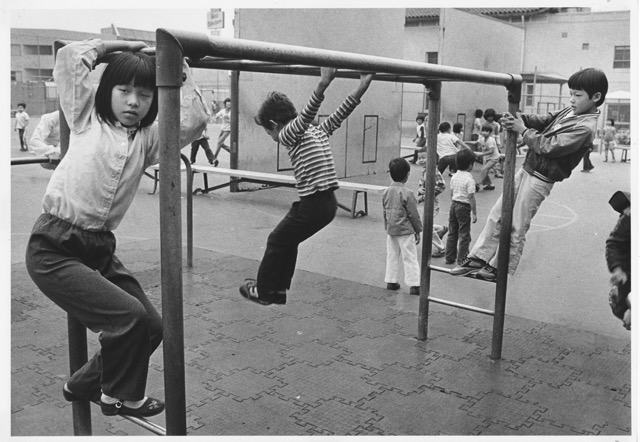
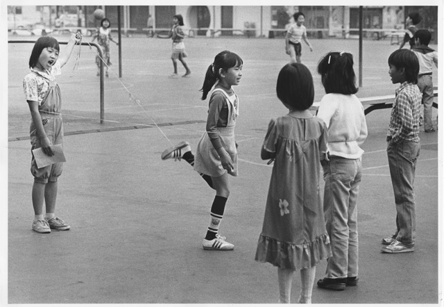

# Skills and Training

\
_Children playing on the monkey bars at the playground. From Castelar Elementary School Collection (1982)._

 

These are the necessary skills that a community archivist needs in their work environment based on our interviews, IS classes, and secondary research.

## Hard Skills

**Archival processing**\
  ‣ Familiarity with ArchivesSpace software\
  ‣ Housing and storage of archival objects
  
**Digitization for digital archives and exhibitions**\
  ‣ Experience with metadata, digital asset management systems, and digital preservation
  
**Knowledge of materials and basics of how to preserve them**\
  ‣ Unique objects may appear in collections, e.g. newspapers, textiles, hand-written letters were found at CHSSC
  
**Language skills**\
  ‣ This was highlighted in our interview with Riona and by Professor Gilliland in IS 431\
  ‣ Important for building trust with community members and understanding cultural relevance of textual artifacts
  
**Strong organizational skills, especially to track individual files and their status**\
  ‣ Baseline expectation to manage and organize data

   

## Soft Skills

**Relationship building**\
  ‣ Professional relationships help open doors; in the case of Riona, she introduced herself to Dr. Caswell, took the community archives class, and then secured the Mellon internship. When CHSSC got the grant she was hired as a full time archivist. Those pre-established relationships were vital in securing her job.\
  ‣ On the community level, relationships and trust are based on listening and showing up. For Riona this meant being intentional about attending community events, and incorporating feedback from the community.\
 ‣ We understand that especially for marginalized communities there are often layers of distrust for academics and institutions. Academics have the reputation of acting like, “they know better, because they have the degree.” This is not true on many levels, and we have to actively show people, through our actions and words, that we care about the community and intend to build real relationships.

**Facilitating mutual respect and mutual trust**\
  ‣ Materials are still owned by the community, it's imperative to approach this work with respect and take the time to build trust with stakeholders and community members.

**Positionality**\
  ‣ Riona acknowledges being an outsider (not born in LA/SoCal) but being ethnically Chinese helps with cultural connection. She’s mindful of the local desires specific to the community. It is important to cultivate a relationship with the community that the archive is for.

**Boundaries**\
  ‣ Standing up for oneself to manage an appropriate workload by communicating what you can and can’t do. This is important for both personal and organizational health.

**Self-motivated**\
  ‣ Community archivists need to be independent and self-sufficient because they are often working alone and researching how to do things.\
  ‣ Determining organizational priorities can improve present and future working conditions for staff. At CHSSC, the space needed to be cleaned and cleared before archival work could start. Riona also identified the need for documentation of archival work and proper write-ups of procedures and policies.

   

\
_Children playing Chinese jump rope at the playground. From Castelar Elementary School Collection (1982)._

 

## Preparation

**“Learn how to learn”**\
The MLIS degree does not prepare us for the in-and-outs of the archival profession; coupled with ever-changing technologies means we will constantly be adapting and learning as the field adjusts to changes. Lean into learning, be receptive to new ideas, and get creative to navigate challenges that come up. 

**Hands on learning**\
Classes within the program are incredibly theory-heavy, so seek out opportunities to apply class learnings. Riona advised, “get internships whenever you can, you learn so much through internships, and you gain a lot of knowledge through work experiences.” Students should pursue jobs and internships that provide praxis to complement the theories and skills they are learning in class.

**Networking**\
Although uncomfortable, students should practice their networking and connecting skills. Through our two conversations, it was evident that relationships built during MLIS programs or internships often lead directly to employment opportunities. Both interviewees emphasized that many opportunities come through professional networks and internships rather than formal job postings.

 

## Suggested Classes

**Community archives**\
Learn theoretical foundations and get hands-on experience.

**Language classes**\
Expands the type and amount of materials you can work with, diversifies archive work and archives.

**Metadata and digital asset management**\
An essential baseline for archival work, particularly for digitization.

**Oral History**\
Essential foundation for documenting histories of community members of diverse backgrounds.

 

[⇽ back](../index.md)
